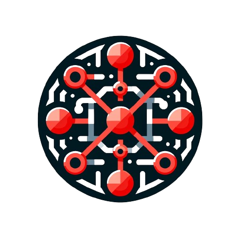

<p align="center">

<br><b>Laravel Package Skeleton</b>
</p>
<p align="center">
<a href="https://github.com/algoyounes/laravel-package-skeleton/actions"></a>
<a href="https://packagist.org/packages/algoyounes/laravel-package-skeleton"></a>
<a href="https://packagist.org/packages/algoyounes/laravel-package-skeleton"></a>
<a href="https://packagist.org/packages/algoyounes/laravel-package-skeleton"></a>
</p>

Creating Laravel packages made it easy! You can start building your own modular, organized package effortlessly.

> [!NOTE]
> This package requires PHP 8.2+ and Laravel 11+ 

## Installation

You can install the package globally via composer:

```
composer global require algoyounes/laravel-package-skeleton
```

## Usage

Once installed, you can use the following commands to streamline your package development process:

**⚡️ Create your package using composer :**
```
composer create-project algoyounes/laravel-package-skeleton --prefer-source YourPackageName
```

**🚀 Run the entire test suite :**
```
composer test
```

Running `composer test` will execute the following tasks :
- 🔄 Refactoring Tests: `composer rector`
- 🧹 Linting Tests: `composer test:lint`
- 🔍 Static Analysis Tests: `composer test:types`
- 🛠️ Unit Tests: `composer test:unit`

**🔧 Install Git Hooks:**
```
composer hook:install
```
Running `composer hook` will execute the following tasks :
- 🔄 Pre-commit Hook: `composer hook:pre-commit`
- 🧹 Pre-push Hook: `composer hook:pre-push`

**🛠️ Fix code issues:**
```
composer fix
```
Running `composer fix` will execute the following tasks:
- ✨ Laravel linting Fixes: `composer fix:lint`
- 🔄 Refactoring Fixes: `composer fix:refactor`
